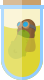

<a id="readme-top"></a>

<!-- PROJECT SHIELDS -->
<!--
*** I'm using markdown "reference style" links for readability.
*** Reference links are enclosed in brackets [ ] instead of parentheses ( ).
*** See the bottom of this document for the declaration of the reference variables
*** for contributors-url, forks-url, etc. This is an optional, concise syntax you may use.
*** https://www.markdownguide.org/basic-syntax/#reference-style-links
-->
[![Contributors][contributors-shield]][contributors-url]
[![Forks][forks-shield]][forks-url]
[![Stargazers][stars-shield]][stars-url]
[![Issues][issues-shield]][issues-url]
[![MIT License][license-shield]][license-url]


<!-- PROJECT LOGO -->
<br />
<div align="center">
  <a href="https://github.com/picklepilot/pickle-jar">
    
  </a>

  <h3 align="center">Component Jar</h3>

  <p>
    A collection of Vue 3 components built using Tailwind CSS.
    <br />
    <a href="https://github.com/picklepilot/pickle-jar"><strong>Explore the docs »</strong></a>
    <br />
    <br />
    <a href="https://github.com/picklepilot/pickle-jar">View Demo</a>
    ·
    <a href="https://github.com/picklepilot/pickle-jar/issues/new?labels=bug&template=bug-report---.md">Report Bug</a>
    ·
    <a href="https://github.com/picklepilot/pickle-jar/issues/new?labels=enhancement&template=feature-request---.md">Request Feature</a>
  
</p>
</div>


<!-- TABLE OF CONTENTS -->
<details>
  <summary>Table of Contents</summary>
  <ol>
    <li>
      <a href="#about-the-project">About The Project</a>
      <ul>
        <li><a href="#built-with">Built With</a></li>
      </ul>
    </li>
    <li>
      <a href="#getting-started">Getting Started</a>
      <ul>
        <li><a href="#prerequisites">Prerequisites</a></li>
        <li><a href="#installation">Installation</a></li>
      </ul>
    </li>
    <li><a href="#usage">Usage</a></li>
    <li><a href="#roadmap">Roadmap</a></li>
    <li><a href="#contributing">Contributing</a></li>
    <li><a href="#license">License</a></li>
    <li><a href="#contact">Contact</a></li>
    <li><a href="#acknowledgments">Acknowledgments</a></li>
  </ol>
</details>


<!-- ABOUT THE PROJECT -->
## About The Project

_The internet is over saturated with awesome component libraries for Vue 3, so I'm adding another one to the mix._

My primary reasons for creating this library are:
* I have my own opinions about style
* I tend to carry those opinions over from project to project
* I want to save some time for myself (and others)
* Many of the freemium offerings tend to hide access to the "goods" behind a paywall, which for me often translates to components like:
  * Column manager
  * AJAX Typeahead
  * Advanced filter / Query builder
  * ...and other enterprise-level components

Use this library if it appeals to your needs.<br />
Pull requests welcome.<br />
General input on the architecture welcome.<br />
Feel free to help me improve this library.

<p align="right">(<a href="#readme-top">back to top</a>)</p>


### Built With

This section should list any major frameworks/libraries used to bootstrap your project. Leave any add-ons/plugins for the acknowledgements section. Here are a few examples.

* [![Vue][Vue.js]][Vue-url]
* [![Vite][Vite]][Vite-url]
* [![Tailwind][TailwindCSS]][Tailwind-url]

<p align="right">(<a href="#readme-top">back to top</a>)</p>


<!-- GETTING STARTED -->
## Getting Started

The main branch supports Vue 3 only, and thus please make sure you are installing this into an environment that uses Vue 3.

> **Note**<br />
> This library is based on the cutting edge versions of the stack that it is intended to be used within. For example, the version of Headless Vue is the insiders version. That is to say that this library should only be used with projects where it is understood that support may be limited.

### Prerequisites 

TODO

### Installation

* via NPM
    ```sh
    npm install component-jar
    ```
* via Yarn
    ```sh
    yarn add component-jar
    ```
  
<p align="right">(<a href="#readme-top">back to top</a>)</p>


<!-- USAGE EXAMPLES -->
## Usage

TODO

<p align="right">(<a href="#readme-top">back to top</a>)</p>


<!-- ROADMAP -->
## Roadmap

- [ ] Add Changelog
- [ ] Add Vitepress documentation
- [ ] Add config for component style customization

See the [open issues](https://github.com/picklepilot/pickle-jar/issues) for a full list of proposed features (and known issues).

<p align="right">(<a href="#readme-top">back to top</a>)</p>


<!-- CONTRIBUTING -->
## Contributing

Contributions are what make the open source community such an amazing place to learn, inspire, and create. Any contributions you make are **greatly appreciated**.

If you have a suggestion that would make this better, please fork the repo and create a pull request. You can also simply open an issue with the tag "enhancement".
Don't forget to give the project a star! Thanks again!

1. Fork the Project
2. Create your Feature Branch (`git checkout -b feature/AmazingFeature`)
3. Commit your Changes (`git commit -m 'Add some AmazingFeature'`)
4. Push to the Branch (`git push origin feature/AmazingFeature`)
5. Open a Pull Request


<!-- LICENSE -->
## License

Distributed under the MIT License. See `LICENSE` for more information.

<p align="right">(<a href="#readme-top">back to top</a>)</p>


<!-- CONTACT -->
## Contact

<!-- Your Name - [@your_twitter](https://twitter.com/your_username) - email@example.com -->

Project Link: [https://github.com/picklepilot/pickle-jar](https://github.com/picklepilot/pickle-jar)

<p align="right">(<a href="#readme-top">back to top</a>)</p>


<!-- ACKNOWLEDGMENTS -->
## Acknowledgments

TODO

<p align="right">(<a href="#readme-top">back to top</a>)</p>


<!-- MARKDOWN LINKS & IMAGES -->
<!-- https://www.markdownguide.org/basic-syntax/#reference-style-links -->
[contributors-shield]: https://img.shields.io/github/contributors/picklepilot/pickle-jar.svg?style=for-the-badge
[contributors-url]: https://github.com/picklepilot/pickle-jar/graphs/contributors
[forks-shield]: https://img.shields.io/github/forks/picklepilot/pickle-jar.svg?style=for-the-badge
[forks-url]: https://github.com/picklepilot/pickle-jar/network/members
[stars-shield]: https://img.shields.io/github/stars/picklepilot/pickle-jar.svg?style=for-the-badge
[stars-url]: https://github.com/picklepilot/pickle-jar/stargazers
[issues-shield]: https://img.shields.io/github/issues/picklepilot/pickle-jar.svg?style=for-the-badge
[issues-url]: https://github.com/picklepilot/pickle-jar/issues
[license-shield]: https://img.shields.io/github/license/picklepilot/pickle-jar.svg?style=for-the-badge
[license-url]: https://github.com/picklepilot/pickle-jar/blob/main/LICENSE
[linkedin-shield]: https://img.shields.io/badge/-LinkedIn-black.svg?style=for-the-badge&logo=linkedin&colorB=555
[linkedin-url]: https://www.linkedin.com/in/justin-kaczmar
[Vue.js]: https://img.shields.io/badge/Vue.js-35495E?style=for-the-badge&logo=vuedotjs&logoColor=4FC08D
[Vue-url]: https://vuejs.org/
[TailwindCSS]: https://img.shields.io/badge/tailwindcss-%2338B2AC.svg?style=for-the-badge&logo=tailwind-css&logoColor=white
[Tailwind-url]: https://tailwindcss.com
[Vite]: https://img.shields.io/badge/vite-%23646CFF.svg?style=for-the-badge&logo=vite&logoColor=white
[Vite-url]: https://vite.dev